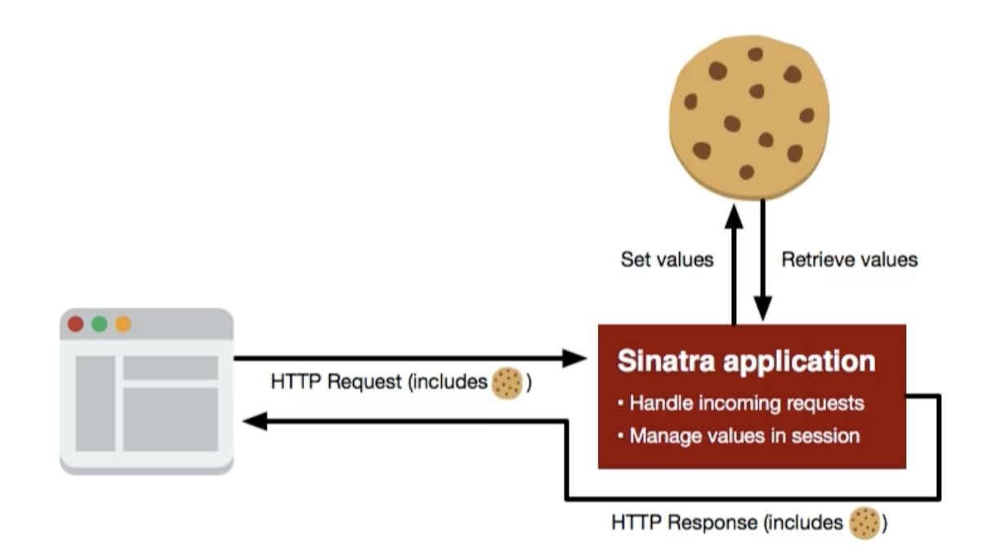
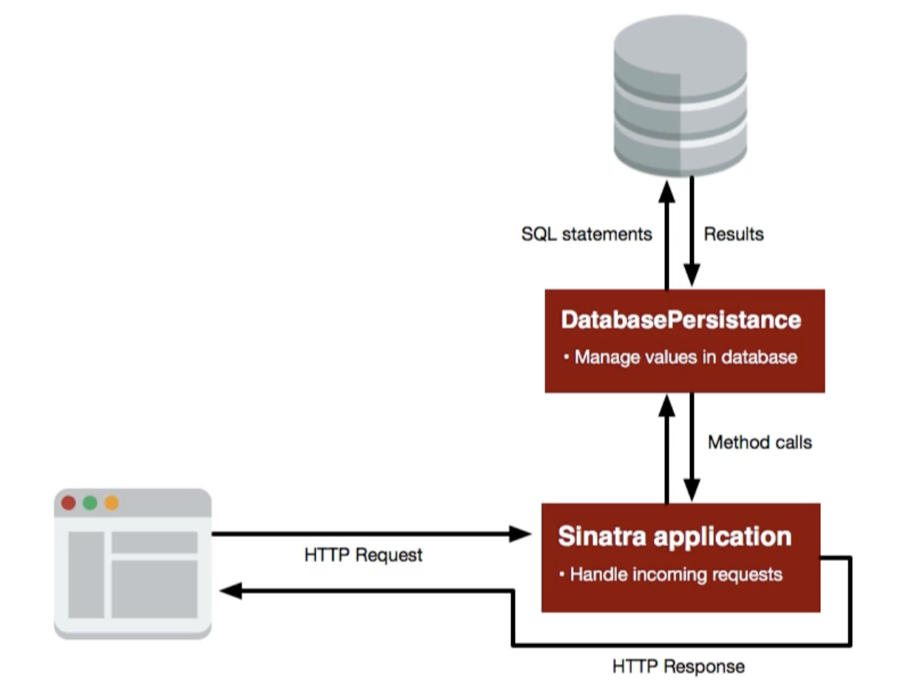

# Sinatra app for Todo webapp

The original Todo app uses only a session to maintain state between HTTP requests.
We want to modify it to use a database to store data instead of a session.

## Original Architecture

This diagram shows the flow of application execution and also the way the data 
is interacted with in the current state of the program. The basic flow is that a
request comes in from a browser that includes a cookie. The application handles
the incoming request and makes changes to the values stored in the session which
are actually stored in the cookie and then sends that back to the browser with
the HTTP response. This interaction happens repeatedly as one interact with the
application and change the data.

Now we want to change the application so that we can store data in a database 
instead of a session. This will allow us to **share data between multiple
browsers/users.** Right now, since everything is stored in a session, the data
will only exist for that particular browser, and not even for other browsers
on the same device.

## Interim Architecture
We want to accomplish this in a two-step process. The first is extract any code
in the current application that work directly with the session into a new class.
Once done, we end up with an application with the following architecture.

The flow is the same as as the original: The browser will send a cookie along
with its request to our application. But instead of our application dealing
directly with the values stored in the session, it will use an instance of the
new class, SessionPersistance, that we'll create. This class will be the new
home for any code that directly interacts with the values in the session. The
setting and retrieving of session values is the same things as what is 
originally done by the sinatra application below. Instead, the sinatra
application will use new methods of SessionPersistance to interact with the
session. 

## Final Architecture
Next, we will replace the SessionPersistance class with a new class,
DatabasePersistance. This class will implement the same methods that 
SessionPersistance class had implemented. Inside these methods, instead of
interacting with a session, it will interact with a SQL database.

The other change is that we no longer need to exchange values between browser
and application using a cookie. But eventually, if we allow users to login to an
application, we will need to have a cookie again. For now, this application will
not support having multiple users intact with the application. Any users that
come to the site is going to see the same set of data. 

This strategy of defining the APIs i.e. method calls used by our application
and the interchangeable classes (SessionPersistance and DatabasePersistance)
that implement those methods is known as the **adapter pattern**. This pattern
is common for this usage: different kinds of storage for data that are different 
in various ways and we want to abstract all those differences away from the
application so that we can run the same application on a variety of different
data stores without having to change the code in the application itself. 

All you have to do is to have a new class that implements a set of methods the
application can call for its data storage and retrieval needs. These methods
will then communicate with the data store of choice, be it PostgreSQL, MySQL etc.